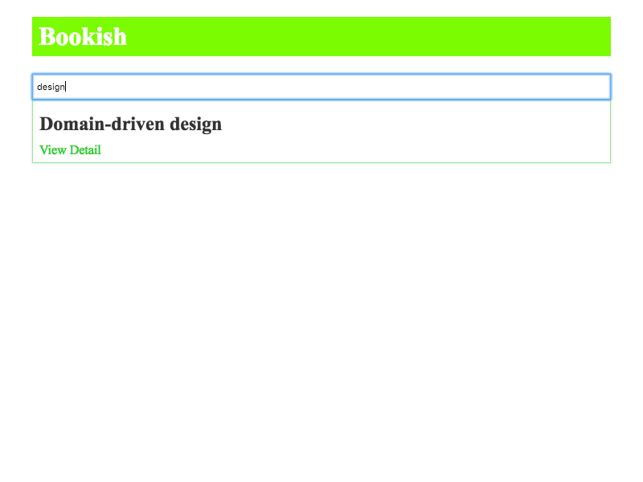

该项目是基于Acceptance Test驱动的一个react学习性项目。包含e2e和unit测试。

## 如何使用
启动本地json-server

```bash
cd mock-server
node server.js
```

启动项目

```bash
npm run start
```

运行测试

```bash
npm run test
```

## 项目展示

以下为项目展示图


## 参考资源
[React](https://reactjs.org/)
[React-Router](https://reacttraining.com/react-router/)
[Redux](https://redux.js.org/)
[React-Redux](https://github.com/reduxjs/react-redux)
[enzyme](http://airbnb.io/enzyme/)
[json-server](https://github.com/typicode/json-server)
[puppeteer](https://github.com/GoogleChrome/puppeteer#readme)
